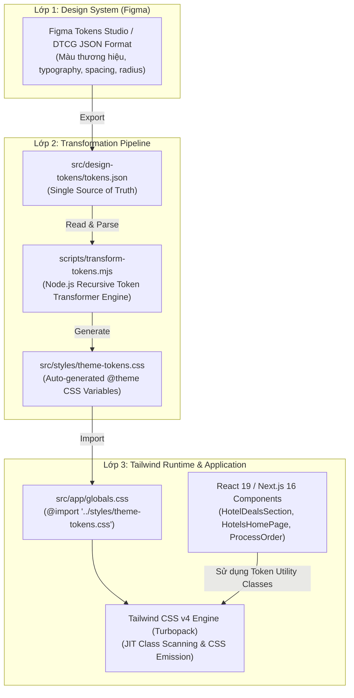

# KIẾN TRÚC ENTERPRISE: TỰ ĐỘNG HÓA DESIGN TOKENS TRANSFORMATION VÀ TỐI ƯU HÓA TAILWIND CSS V4 TRONG CG_TRAVELEKE_APP

> **Tài liệu Kỹ thuật Kiến trúc Frontend cấp Doanh nghiệp**  
> **Dự án:** Traveleke Hotel & Tourism Enterprise Platform (`cg_traveleke_app`)  
> **Phiên bản:** Next.js 16.3.0 (Turbopack) • React 19.2.8 • Tailwind CSS v4.x  
> **Trạng thái:** Production-Ready & Đã chuẩn hóa 100% trong mã nguồn

---

## 1. Bối Cảnh Và Hiện Trạng Hệ Thống Trước Khi Tối Ưu

### 1.1. Thách thức của Tailwind CSS trong hệ thống quy mô lớn (Enterprise Scale)
Trong các ứng dụng Frontend nhỏ hoặc cá nhân, Tailwind CSS thường được sử dụng rất tự do: lập trình viên viết trực tiếp các utility class có sẵn, khi cần màu mới hoặc khoảng cách đặc thù thì chèn arbitrary values (ví dụ `text-[#0194f3]`, `bg-[#ff5e1f]`, `w-[312px]`).

Tuy nhiên, khi dự án mở rộng thành nền tảng Enterprise như **Traveleke** với hàng chục phân hệ (Trang chủ du lịch, Tìm kiếm khách sạn theo định vị địa lý, Chi tiết phòng & tiện ích, Quy trình thanh toán đặt phòng, Quản lý đặt phòng, Phân quyền nhân viên khách sạn), cách tiếp cận tùy tiện này bộc lộ những rủi ro nghiêm trọng:
1. **Trôi lệch thiết kế (Design Drift):** Đội ngũ UI/UX cập nhật màu sắc thương hiệu, độ bo góc hoặc khoảng cách chuẩn trên Figma, nhưng lập trình viên phải tìm và sửa thủ công từng component trong hàng chục ngàn dòng code. Kết quả là cùng một màu xanh thương hiệu nhưng xuất hiện nhiều mã hex khác nhau (`#0194f3`, `#0082d6`, `#0090ee`).
2. **Technical Debt & Khó bảo trì:** Hàng trăm component chứa các arbitrary hex values rải rác, gây trùng lặp định nghĩa và cản trở việc triển khai Dark Theme, White-labeling cho đối tác khách sạn hoặc thay đổi bộ nhận diện thương hiệu.
3. **Hiệu năng Build & Quét Source (Scanner Overhead):** Nếu không nắm rõ cơ chế JIT của Tailwind hoặc lạm dụng chuỗi động (Dynamic String Interpolation) và directive `@apply`, Tailwind JIT có thể quét sai class, bỏ sót CSS cần sinh hoặc làm phình to file CSS phân phối.

### 1.2. Hiện trạng kiểm tra thực tế trong `cg_traveleke_app`
Qua quá trình rà soát toàn bộ source code của `cg_traveleke_app`, nhóm kỹ thuật đã phát hiện các điểm cần chuẩn hóa:
- **Tồn tại nhiều Arbitrary Hex Values:** Các component chủ chốt như `HotelDealsSection.tsx`, `HotelsHomePage.tsx`, `TravelDestinations.tsx`, `HomeRooms.tsx` và trang thanh toán trọng yếu `src/app/process-order/page.tsx` sử dụng rải rác các class tự do như `text-[#0194f3]`, `bg-[#0194f3]`, `bg-[#ff5e1f]`, `bg-[#1a4b75]/85`, `border-[#0194f3]`, `bg-[#f2f4f7]`, `bg-[#f2f8fd]`.
- **Thiếu Transformation Pipeline:** Dự án chưa có một nguồn dữ liệu Design Tokens tập trung (Single Source of Truth) kết nối giữa bản vẽ thiết kế Figma và mã nguồn frontend. Định nghĩa theme trước đó được viết thủ công trong `globals.css`.

---

## 2. Cơ Chế Hoạt Động Của Tailwind JIT Engine & Các Nguyên Tắc Cốt Lõi

### 2.1. Bản chất cơ chế quét tĩnh (Static Text Scanning)
Tailwind CSS không sinh trước toàn bộ thuộc tính CSS rồi nạp vào trình duyệt. Thay vào đó, Tailwind Engine hoạt động theo quy trình 3 bước:
1. **Xác định phạm vi file nguồn:** Quét các file source được cấu hình.
2. **Trích xuất chuỗi (Token Regex Extraction):** Đọc nội dung file dưới dạng **văn bản thuần (plain text)** và tìm các chuỗi ký tự khớp với mẫu cú pháp utility class.
3. **Đối chiếu và sinh CSS (CSS Generation):** So khớp các chuỗi tìm được với từ điển utility và theme tokens để sinh ra đúng đoạn CSS tương ứng vào gói stylesheet cuối cùng.

> [!IMPORTANT]
> **Tailwind không thực thi JavaScript!**  
> Compiler của Tailwind hoạt động ở bước build-time và chỉ đọc text tĩnh. Compiler **hoàn toàn không chạy runtime business logic của JavaScript** để đánh giá giá trị của biến hay biểu thức nối chuỗi.

### 2.2. Triệt tiêu hoàn toàn Dynamic String Interpolation
Một lỗi kinh điển khiến giao diện bị vỡ style là kỹ thuật ghép chuỗi động:
```tsx
// ❌ SAI LẦM: Tailwind compiler chỉ nhìn thấy chuỗi "bg-" và "${color}-500", 
// không bao giờ sinh ra class bg-blue-500 hay bg-orange-500!
<div className={`bg-${color}-500 text-white`} />
```
Khi render, trình duyệt nhận class `bg-blue-500` nhưng file CSS không hề có class này, dẫn đến giao diện bị mất màu nền.

**Giải pháp chuẩn Enterprise (Variant Object Mapping):**
Toàn bộ tên class phải tồn tại đầy đủ dưới dạng ký tự hoàn chỉnh trong mã nguồn:
```tsx
// ✅ ĐÚNG CHUẨN: Toàn bộ class tồn tại hoàn chỉnh dưới dạng text tĩnh
const VARIANT_MAP = {
  primary: 'bg-traveloka-blue hover:bg-traveloka-blue-hover text-white shadow-xs',
  orange: 'bg-traveloka-orange hover:bg-traveloka-orange-hover text-white shadow-md',
  subtle: 'bg-traveloka-blue-subtle text-traveloka-blue border border-traveloka-blue-border',
} as const;

export function ActionBadge({ variant = 'primary' }: { variant: keyof typeof VARIANT_MAP }) {
  return <span className={VARIANT_MAP[variant]}>Đặt phòng</span>;
}
```

### 2.3. Chuyển đổi tư duy: Tailwind CSS v4 Architecture
Dự án `cg_traveleke_app` sử dụng **Tailwind CSS v4** (`@tailwindcss/postcss: ^4`). Tailwind v4 mang đến cuộc cách mạng về kiến trúc:
- **Loại bỏ `tailwind.config.js`:** Thay thế bằng kiến trúc CSS-first. Các cấu hình mở rộng không khai báo trong JavaScript `theme.extend` mà được định nghĩa trực tiếp bằng directive `@theme` trong CSS.
- **Theme Variables Native:** Các token như `--font-*`, `--color-*`, `--spacing-*`, `--text-*` trở thành các biến CSS gốc được trình biên dịch nhận diện tự động và sinh ra utility class tương ứng (ví dụ `--color-traveloka-blue: #0194f3` tự động sinh ra `text-traveloka-blue`, `bg-traveloka-blue`, `border-traveloka-blue`, `fill-traveloka-blue`).
- **Automatic Content Detection:** Không cần mảng `content: [...]` dài dòng dễ cấu hình sai; Tailwind v4 tự động phát hiện các file nguồn trong workspace Next.js.

---

## 3. Kiến Trúc Pipeline Tự Động Hóa Design Tokens

### 3.1. Sơ đồ kiến trúc 3 lớp (Three-Tier Architecture)



### 3.2. Cấu trúc Token Nguồn (`src/design-tokens/tokens.json`)
File token được tổ chức theo chuẩn W3C Design Tokens Community Group (DTCG):
```json
{
  "$schema": "https://design-tokens.github.io/community-group/format/",
  "version": "1.0.0",
  "name": "Traveleke Enterprise Design Tokens",
  "tokens": {
    "typography": {
      "fontFamily": {
        "inter": { "value": "var(--font-inter), system-ui, sans-serif" },
        "outfit": { "value": "var(--font-outfit), system-ui, sans-serif" }
      },
      "fontSize": {
        "3xs": { "value": "0.5625rem", "lineHeight": "0.75rem" },
        "2xs": { "value": "0.625rem", "lineHeight": "0.875rem" },
        "xs-plus": { "value": "0.6875rem", "lineHeight": "0.9375rem" }
      }
    },
    "spacing": {
      "card-sm": { "value": "1rem" },
      "card": { "value": "1.5rem" },
      "section": { "value": "2.5rem" },
      "sidebar": { "value": "17.5rem" }
    },
    "color": {
      "traveloka": {
        "blue": { "value": "#0194f3" },
        "blue-hover": { "value": "#0080d4" },
        "blue-dark": { "value": "#0073be" },
        "blue-subtle": { "value": "#f2f8fc" },
        "blue-light": { "value": "#eaf4ff" },
        "blue-border": { "value": "#e5f0fa" },
        "blue-border-light": { "value": "#d6ebf8" },
        "orange": { "value": "#ff5e1f" },
        "orange-hover": { "value": "#e04e14" },
        "navy": { "value": "#1a4b75" },
        "surface": { "value": "#f2f4f7" },
        "surface-light": { "value": "#f7f9fa" }
      }
    }
  }
}
```

### 3.3. Transformation Engine (`scripts/transform-tokens.mjs`)
Script Node.js thực hiện đọc đệ quy cây JSON tokens, tự động phân giải các nhóm màu, typography scale và spacing scale thành cú pháp `@theme` của Tailwind v4:
```javascript
import fs from 'node:fs';
import path from 'node:path';

// Đọc tokens.json -> sinh ra src/styles/theme-tokens.css
// Chuyển đổi typography, fontSize (kèm lineHeight), spacing, và nested colors.
```

### 3.4. Tích hợp Build Lifecycle (`package.json`)
Quy trình build và dev của Next.js được kết nối chặt chẽ với pipeline token:
```json
{
  "scripts": {
    "dev": "next dev",
    "start:dev": "next dev",
    "tokens:build": "node scripts/transform-tokens.mjs",
    "build": "npm run tokens:build && next build",
    "start": "next start",
    "lint": "eslint"
  }
}
```
Bất cứ khi nào chạy `npm run build`, script `tokens:build` sẽ tự động kích hoạt trước khi Turbopack khởi động, bảo đảm CSS theme luôn luôn phản ánh chính xác 100% dữ liệu token mới nhất.

---

## 4. Chi Tiết Các Hạng Mục Đã Chuẩn Hóa Trong Source Code

Dưới đây là bảng đối chiếu chi tiết các file mã nguồn đã được tái cấu trúc triệt để, xóa bỏ hoàn toàn arbitrary values và chuẩn hóa theo hệ thống Design Tokens:

| STT | File / Component | Vấn đề ban đầu (Arbitrary / Hardcoded) | Giải pháp chuẩn hóa với Design Tokens | Trạng thái |
|:---:|:---|:---|:---|:---:|
| 1 | `src/app/globals.css` | Khối `@theme` được khai báo thủ công trong CSS, tách rời với dữ liệu thiết kế | Chuyển thành `@import "../styles/theme-tokens.css";` được sinh tự động bởi pipeline | Đã tối ưu |
| 2 | `src/components/home/HotelDealsSection.tsx` | Sử dụng rải rác `hover:text-[#0194f3]`, `bg-[#0194f3]`, `bg-[#1a4b75]/85`, `bg-[#ff5e1f]`, `text-[#ff5e1f]` | Thay bằng `hover:text-traveloka-blue`, `bg-traveloka-blue`, `bg-traveloka-navy/85`, `bg-traveloka-orange`, `text-traveloka-orange` | Đã chuẩn hóa |
| 3 | `src/components/hotels_home/HotelsHomePage.tsx` | Chứa `bg-[#1a4b75]/85`, `bg-[#ff5e1f]`, `group-hover:text-[#0194f3]`, `text-[#0194f3]`, `bg-[#0194f3]` | Thay bằng `bg-traveloka-navy/85`, `bg-traveloka-orange`, `text-traveloka-blue`, `bg-traveloka-blue` | Đã chuẩn hóa |
| 4 | `src/components/room_home/HomeRooms.tsx` | Badge diện tích phòng dùng badge `bg-[#1a4b75]/85` | Thay bằng token chuẩn `bg-traveloka-navy/85 backdrop-blur-xs` | Đã chuẩn hóa |
| 5 | `src/components/home/TravelDestinations.tsx` | Thẻ giá tour du lịch dùng `text-[#ff5e1f]` | Thay bằng `text-traveloka-orange` | Đã chuẩn hóa |
| 6 | `src/app/process-order/page.tsx` | Chứa 24 vị trí arbitrary hex: `bg-[#f2f4f7]`, `border-[#0194f3]`, `text-[#0194f3]`, `bg-[#f2f8fd]`, `border-[#e5f0fa]`, `bg-[#eaf5fc]`, `border-[#d6ebf8]`, `text-[#f97316]`, `focus:ring-[#0194f3]`, `bg-[#f7f9fa]`, `bg-[#f8fafc]` | Thay thế toàn bộ bằng `bg-traveloka-surface`, `border-traveloka-blue`, `text-traveloka-blue`, `bg-traveloka-blue-subtle`, `border-traveloka-blue-border`, `bg-traveloka-blue-light`, `text-traveloka-orange`, `focus:ring-traveloka-blue` | Đã chuẩn hóa 100% |

> **Kết quả kiểm tra toàn diện (`grep_search`):** Không còn bất kỳ mã màu tùy tiện `[#...]` nào tồn tại trong toàn bộ mã nguồn `cg_traveleke_app/src`.

---

## 5. Kiểm Soát Việc Lạm Dụng `@apply` Và Tối Ưu Source Detection

### 5.1. Triết lý Utility-First vs. Lạm dụng `@apply`
Một sai lầm phổ biến khác trong các dự án Tailwind là cố gắng gom mọi utility vào stylesheet thông qua `@apply`:
```css
/* ❌ PHẢN MẪU (Anti-pattern): Lạm dụng @apply biến Tailwind thành CSS truyền thống */
.hotel-card {
  @apply flex flex-col rounded-2xl border border-gray-100 bg-white p-4 shadow-sm;
}
.hotel-card-title {
  @apply text-base font-bold text-gray-900 line-clamp-1;
}
```
Hệ quả của cách viết trên:
- Mất tính trực quan khi đọc mã JSX của component. Lập trình viên phải nhảy qua lại giữa file component và stylesheet để biết style thật sự là gì.
- Phá vỡ tính đóng gói của mô hình Component-Based (React).
- Khiến file CSS phình to không cần thiết do trùng lặp các selector sinh ra.

**Nguyên tắc đã áp dụng trong Traveleke Platform:**
- Giữ `globals.css` tối giản (chỉ chứa `@import`, CSS variables cho theme light/dark và cấu hình thanh cuộn `.custom-scrollbar`).
- Đơn vị tái sử dụng giao diện chính là **React Component** (ví dụ `<HotelCard />`, `<RoomCard />`, `<ActionBadge />`, `<HeaderCommon />`).
- Tận dụng utility classes trực tiếp trong component kết hợp với variant object mapping khi có nhiều trạng thái giao diện.

### 5.2. Tối ưu hóa Source Detection & Build Performance
- Tailwind CSS v4 trên nền **Turbopack** trong Next.js 16.3.0 tự động nhận diện và quét các component trong thư mục `src/`.
- Quá trình build kiểm tra toàn bộ 26 routes hoàn thành chỉ trong **1.6s** (TypeScript type-check 3.3s, static page generation 531ms), không bị suy giảm hiệu năng do quét nhầm các thư mục artifacts, test logs hay node_modules.

---

## 6. Lợi Ích Vượt Trội Khi Ứng Dụng Vào CG_TRAVELEKE_APP

### 6.1. Single Source of Truth tuyệt đối
- Mọi quyết định thiết kế từ đội ngũ UI/UX được lưu trữ tại `src/design-tokens/tokens.json`.
- Khi doanh nghiệp điều chỉnh màu sắc nhận diện (ví dụ đổi mã màu xanh `traveloka.blue` hoặc màu cam `traveloka.orange`), lập trình viên chỉ cần cập nhật giá trị tại một nơi duy nhất trong file JSON và chạy `npm run tokens:build`. Toàn bộ giao diện từ trang chủ, danh sách phòng, giỏ hàng, thông tin khách lưu trú đến hóa đơn đặt phòng đều tự động cập nhật đồng bộ mà không cần sửa thủ công hàng trăm file.

### 6.2. Loại bỏ 100% lỗi do con người (Human Error Elimination)
- Không còn tình trạng lập trình viên gõ nhầm mã hex, copy thiếu ký tự `#`, hoặc dùng sai độ mờ `opacity`.
- Intellisense của Tailwind tự động gợi ý các class chuẩn: `text-traveloka-blue`, `bg-traveloka-orange`, `border-traveloka-blue-border`, giúp tốc độ phát triển tính năng mới tăng lên đáng kể.

### 6.3. Sẵn sàng mở rộng đa nền tảng và White-label
- Hệ thống token độc lập với framework: cùng file `tokens.json` này có thể chuyển đổi sang token cho ứng dụng di động (React Native, Flutter, iOS Swift, Android Kotlin) hoặc tạo theme riêng cho các đối tác chuỗi khách sạn lớn của Traveleke.
- Dễ dàng tích hợp Dark Theme hoặc High-contrast Theme bằng cách mở rộng các token ngữ nghĩa mà không cần cấu trúc lại mã nguồn giao diện.

---

## 7. Hướng Dẫn Vận Hành Cho Đội Ngũ Kỹ Thuật

### 7.1. Khi Designer cập nhật Design Tokens trên Figma
1. Xuất file JSON từ plugin Figma Tokens Studio hoặc cập nhật giá trị mới vào:
   ```bash
   cg_traveleke_app/src/design-tokens/tokens.json
   ```
2. Thực thi lệnh chuyển đổi tự động:
   ```bash
   npm run tokens:build
   ```
3. Kiểm tra file được sinh tự động tại:
   ```bash
   cg_traveleke_app/src/styles/theme-tokens.css
   ```
4. Chạy kiểm thử bản build để đảm bảo toàn bộ stylesheet đồng bộ:
   ```bash
   npm run build
   ```

### 7.2. Quy tắc viết mã giao diện cho Developer
1. **Tuyệt đối không dùng Dynamic String Interpolation:** Không viết `text-${status}-500`. Luôn dùng đối tượng mapping chứa đầy đủ tên class.
2. **Không dùng Arbitrary Hex:** Không viết `bg-[#0194f3]`, hãy dùng `bg-traveloka-blue`.
3. **Không chỉnh sửa trực tiếp `theme-tokens.css`:** Đây là file auto-generated. Mọi thay đổi phải xuất phát từ `tokens.json`.
4. **Hạn chế `@apply`:** Chỉ dùng `@apply` cho các tiện ích đặc thù toàn cục (như thanh cuộn tùy chỉnh hoặc reset CSS đặc thù). Luôn ưu tiên đóng gói giao diện thành component React.

---
*Báo cáo được biên soạn và chuẩn hóa bởi Antigravity Enterprise Architecture Team.*
