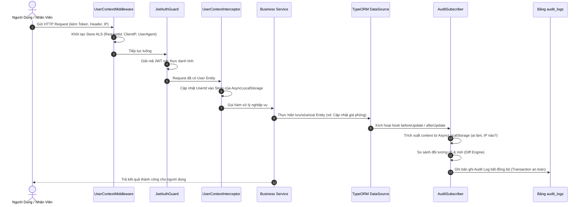
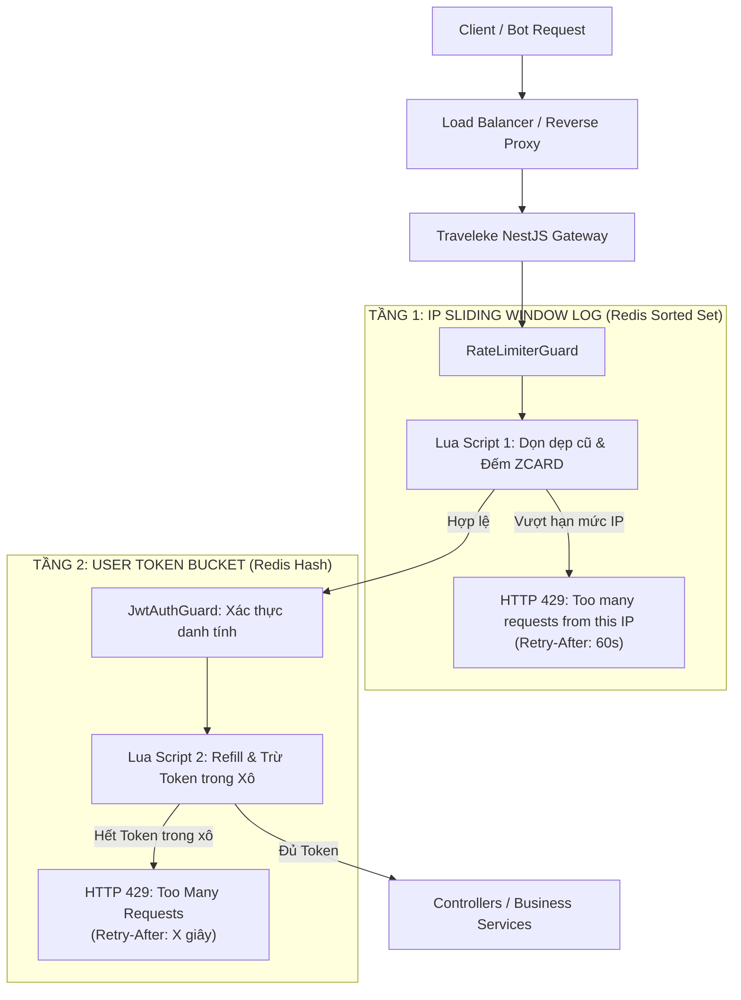

# TÀI LIỆU KIẾN TRÚC ENTERPRISE: AUDIT LOGGING ENGINE VÀ RATE LIMITING ĐA TẦNG TRONG NESTJS
> **Hệ thống Quản lý & Đặt phòng Khách sạn Traveleke**  
> **Ngôn ngữ & Nền tảng:** NestJS 11, TypeScript, MySQL, Redis, TypeORM, AsyncLocalStorage

---

## MỤC LỤC
1. [TỔNG QUAN HỆ THỐNG AN NINH & VẬN HÀNH TOÀN DIỆN](#1-tổng-quan-hệ-thống-an-ninh--vận-hành-toàn-diện)
2. [PHẦN 1: AUDIT LOGGING ENGINE TỰ ĐỘNG](#phần-1-audit-logging-engine-tự-động)
   - [1.1. Thách thức trong việc theo dõi lịch sử biến động dữ liệu](#11-thách-thức-trong-việc-theo-dõi-lịch-sử-biến-động-dữ-liệu)
   - [1.2. Giải pháp: AsyncLocalStorage kết hợp TypeORM Subscribers](#12-giải-pháp-asynclocalstorage-kết-hợp-typeorm-subscribers)
   - [1.3. Luồng hoạt động chi tiết (Flow Architecture)](#13-luồng-hoạt-động-chi-tiết-flow-architecture)
   - [1.4. Diff Engine: Tối ưu lưu trữ dữ liệu trước & sau biến động](#14-diff-engine-tối-ưu-lưu-trữ-dữ-liệu-trước--sau-biến-động)
   - [1.5. Ứng dụng thực tế & Lợi ích sống còn cho Traveleke](#15-ứng-dụng-thực-tế--lợi-ích-sống-còn-cho-traveleke)
3. [PHẦN 2: RATE LIMITING ĐA TẦNG VỚI REDIS](#phần-2-rate-limiting-đa-tầng-với-redis)
   - [2.1. Bản chất Rate Limiting & Hạn chế của In-Memory Cache](#21-bản-chất-rate-limiting--hạn-chế-của-in-memory-cache)
   - [2.2. Vấn đề Race Condition & Sức mạnh của Redis Lua Script](#22-vấn-đề-race-condition--sức-mạnh-của-redis-lua-script)
   - [2.3. Hai thuật toán cốt lõi: Sliding Window Log vs Token Bucket](#23-hai-thuật-toán-cốt-lõi-sliding-window-log-vs-token-bucket)
   - [2.4. Kiến trúc Rate Limiting Đa Tầng (Multi-Tier Architecture)](#24-kiến-trúc-rate-limiting-đa-tầng-multi-tier-architecture)
   - [2.5. Chiến lược Chống sập Fail-Open (Resilience Pattern)](#25-chiến-lược-chống-sập-fail-open-resilience-pattern)
   - [2.6. Chuẩn hóa Headers RFC và Xử lý HTTP 429](#26-chuẩn-hóa-headers-rfc-và-xử-lý-http-429)
   - [2.7. Ứng dụng cụ thể trong hệ thống Traveleke](#27-ứng-dụng-cụ-thể-trong-hệ-thống-traveleke)
4. [TỔNG KẾT: MÔ HÌNH PHÒNG THỦ CHIỀU SÂU (DEFENSE IN DEPTH)](#4-tổng-kết-mô-hình-phòng-thủ-chiều-sâu-defense-in-depth)

---

## 1. TỔNG QUAN HỆ THỐNG AN NINH & VẬN HÀNH TOÀN DIỆN

Hệ thống Traveleke được thiết kế với tư duy phần mềm doanh nghiệp (**Enterprise Architecture**), áp dụng mô hình bảo vệ nhiều lớp:

```text
                                CLIENT REQUEST
                                      │
                                      ▼
             [ LỚP 1: BẢO VỆ TẦNG MẠNG & CHỐNG SPAM ]
             ► Rate Limiting Đa Tầng (Redis + Lua Scripts)
               • Tầng IP: Chặn Brute-force, Scraping, Spam Bot (Sliding Window Log)
               • Tầng User: Điều phối lưu lượng burst tự nhiên (Token Bucket)
                                      │
                                      ▼ (Request hợp lệ)
             [ LỚP 2: ĐỊNH DANH & NGỮ CẢNH HỆ THỐNG ]
             ► Authentication & AsyncLocalStorage
               • Xác thực JWT Token & Phân quyền Roles
               • Tự động thu thập User Context (UserId, IP, UserAgent, RequestId)
                                      │
                                      ▼
             [ LỚP 3: XỬ LÝ NGHIỆP VỤ & TỰ ĐỘNG KIỂM TOÁN ]
             ► Business Service + Audit Logging Engine
               • Xử lý Booking, Khách sạn, Dịch vụ, Phòng
               • TypeORM Subscriber tự động bắt mọi biến động CSDL (Diff Engine)
               • Bất khả chối bỏ trách nhiệm (Non-Repudiation)
```

---

## PHẦN 1: AUDIT LOGGING ENGINE TỰ ĐỘNG
### (AsyncLocalStorage + TypeORM Entity Subscribers)

### 1.1. Thách thức trong việc theo dõi lịch sử biến động dữ liệu
Trong một ứng dụng quản lý khách sạn và đặt phòng:
* **Gian lận nội bộ:** Một nhân viên lễ tân có thể tự ý sửa giá phòng từ `2.000.000 VNĐ` xuống `200.000 VNĐ` rồi đặt cho người quen, sau đó sửa lại giá cũ. Nếu không có nhật ký kiểm toán, chủ khách sạn không thể biết ai đã can thiệp vào lúc nào.
* **Tranh chấp với khách hàng:** Khách khiếu nại rằng họ không hề bấm huỷ phòng nhưng phòng lại bị huỷ. Cần dữ liệu bằng chứng xác minh: Lệnh huỷ được gửi từ IP nào, thiết bị gì, vào thời điểm nào?
* **Nhược điểm của cách làm truyền thống (Manual Logging):**
  * Developer phải viết lệnh ghi log thủ công ở từng hàm trong từng Service (`bookingService.update`, `roomService.updatePrice`,...).
  * Dễ bị quên sót, làm code nghiệp vụ bị rối rác, bảo trì cực kỳ khó khăn.
  * Phải truyền `userId`, `ipAddress` xuyên qua hàng loạt tầng controller -> service -> repository gây ô nhiễm tham số (Parameter Pollution).

---

### 1.2. Giải pháp: AsyncLocalStorage kết hợp TypeORM Subscribers

Sự kết hợp giữa **Node.js AsyncLocalStorage** và **TypeORM Entity Subscribers** đã giải quyết triệt để vấn đề:

1. **AsyncLocalStorage (ALS):**
   * Hoạt động tương tự `ThreadLocal` trong Java hoặc C#.
   * Cho phép lưu trữ ngữ cảnh của người gọi request (gồm `userId`, `ipAddress`, `userAgent`, `requestId`) tồn tại xuyên suốt chu kỳ sống bất đồng bộ của request đó.
   * Mọi tầng sâu nhất trong ứng dụng (kể cả tầng ORM Entity Subscriber) đều có thể truy cập thông tin người dùng hiện tại mà không cần truyền bất kỳ tham số nào qua hàm.

2. **TypeORM Entity Subscribers:**
   * Lắng nghe trực tiếp các sự kiện của Database ở tầng ORM: `beforeInsert`, `afterInsert`, `beforeUpdate`, `afterUpdate`, `beforeRemove`, `afterRemove`.
   * Chạy hoàn toàn tự động ngầm bên dưới. Bất cứ khi nào có thay đổi dữ liệu (từ bất kỳ Controller hay Cronjob nào), Subscriber đều bắt được và ghi lại vào bảng `audit_logs`.

---

### 1.3. Luồng hoạt động chi tiết (Flow Architecture)



---

### 1.4. Diff Engine: Tối ưu lưu trữ dữ liệu trước & sau biến động
Nếu lưu lại toàn bộ bản ghi cũ và mới mỗi lần cập nhật, dung lượng database sẽ tăng chóng mặt.  
Hệ thống Traveleke tích hợp **Diff Engine thông minh**:
* Tự động so sánh từng trường dữ liệu giữa `databaseEntity` (trước khi sửa) và `entity` (sau khi sửa).
* Bỏ qua các trường kỹ thuật tự động cập nhật như `updated_at`.
* Chỉ trích xuất và lưu đúng các trường thực sự thay đổi:

```json
{
  "oldValues": {
    "price_per_night": "2000000.00",
    "status": "AVAILABLE"
  },
  "newValues": {
    "price_per_night": "1500000.00",
    "status": "MAINTENANCE"
  }
}
```

---

### 1.5. Ứng dụng thực tế & Lợi ích sống còn cho Traveleke

| Nghiệp vụ trong Traveleke | Tình huống rủi ro | Lợi ích khi có Audit Logging Engine |
| :--- | :--- | :--- |
| **Phân công Nhân viên phụ trách phòng / Đơn đặt** | Nhân viên A đẩy việc cho nhân viên B, hoặc xóa phân công để trốn việc. | Ghi lại chính xác ai đã đổi người phụ trách, thời điểm đổi và ghi chú lý do. |
| **Biến động Trạng thái Booking** | Đơn phòng chuyển từ `PENDING` sang `CONFIRMED` hoặc `CANCELLED`. | Bằng chứng đối soát với khách và nhân viên, chống chối bỏ trách nhiệm. |
| **Thay đổi Giá phòng & Dịch vụ khách sạn** | Giá phòng bị hạ thấp vào dịp lễ tết do lỗi cấu hình hoặc can thiệp trái phép. | Lãnh đạo khách sạn tra cứu được ai đã sửa giá, lúc mấy giờ từ IP nào. |
| **Xóa dữ liệu nhạy cảm** | Dữ liệu khách hàng, đánh giá hoặc lịch sử phòng bị xóa. | Lưu giữ vết tích cũ trước khi bị xóa phục vụ khôi phục và điều tra an ninh. |
| **Tuân thủ tiêu chuẩn bảo mật** | Kiểm định phần mềm và bảo vệ dữ liệu cá nhân (GDPR, ISO 27001). | Đáp ứng 100% tiêu chuẩn kiểm toán hệ thống bắt buộc của các doanh nghiệp lớn. |

---

## PHẦN 2: RATE LIMITING ĐA TẦNG VỚI REDIS
### (Token Bucket & Sliding Window Log)

### 2.1. Bản chất Rate Limiting & Hạn chế của In-Memory Cache
* **Rate Limiting:** Kỹ thuật kiểm soát số lượng request tối đa mà một client (IP hoặc User) được phép gửi tới máy chủ trong một khung thời gian.
* **Hạn chế chết người của In-Memory Rate Limit:**  
  Trong môi trường sản xuất chạy nhiều Node.js instances phía sau Load Balancer:
  * Instance 1 đếm IP đó đã gửi 5 requests.
  * Instance 2 đếm 4 requests.
  * Instance 3 đếm 4 requests.  
  Client thực tế đã gửi **13 requests**, nhưng mỗi server chỉ nhìn thấy một phần, dẫn đến việc rate limit bị qua mặt hoàn toàn.
* **Giải pháp:** Sử dụng **Redis tập trung (Centralized Redis Cache)** làm nơi chia sẻ trạng thái chung cho toàn bộ các server instances.

---

### 2.2. Vấn đề Race Condition & Sức mạnh của Redis Lua Script
Nếu thực hiện bằng các lệnh tuần tự thông thường:
1. `GET key` (Đọc số dư token)
2. Kiểm tra nếu `tokens > 0`
3. `SET key` (Trừ token)

Trong mili-giây giữa bước 1 và bước 3, có thể có 100 request đồng thời chen vào cùng đọc thấy `tokens = 1`, khiến cả 100 request đều được cho phép qua (**Race Condition**).

👉 **Giải pháp:** Đưa toàn bộ thuật toán vào **Redis Lua Script**. Redis thực thi Lua script theo cơ chế **đơn luồng, nguyên tử tuyệt đối (Atomic Operation)**: Không một request nào khác có thể chen ngang trong quá trình script đang tính toán.

---

### 2.3. Hai thuật toán cốt lõi: Sliding Window Log vs Token Bucket

| Tiêu chí | 1. Sliding Window Log (Tầng IP) | 2. Token Bucket (Tầng User) |
| :--- | :--- | :--- |
| **Mục đích** | Kiểm soát chính xác tuyệt đối theo cửa sổ thời gian trượt (Time Window). | Cho phép lưu lượng bùng nổ tự nhiên (**Burst Traffic**) có kiểm soát. |
| **Cấu trúc Redis** | **Redis Sorted Set (ZSET)**: `score = timestamp`, `member = requestId`. | **Redis Hash**: `available` (số token) & `updatedAt` (thời điểm tính). |
| **Bộ nhớ (Memory)** | Cao hơn (lưu timestamp từng request trong window). | Rất thấp (chỉ lưu 2 trường số học). |
| **Cơ chế hoạt động** | • Xoá các log cũ hơn `now - windowMs`<br/>• Đếm `ZCARD`<br/>• Nếu `< limit`: Cho phép & thêm log mới | • Tính thời gian trôi qua: `elapsed = now - updatedAt`<br/>• Hồi token: `available = min(cap, available + elapsed * rate)`<br/>• Trừ token theo chi phí (`cost`) |
| **Độ phù hợp** | Cực kỳ phù hợp cho **IP ẩn danh, chống Brute-force & Scraping**. | Cực kỳ phù hợp cho **Người dùng đã đăng nhập, API thanh toán & dịch vụ**. |

---

### 2.4. Kiến trúc Rate Limiting Đa Tầng (Multi-Tier Architecture)



---

### 2.5. Chiến lược Chống sập Fail-Open (Resilience Pattern)
Rate Limiter nằm trên đường đi của **100% tất cả các request**.  
Nếu Redis bị mất kết nối mạng hoặc server Redis gặp sự cố:
* **Fail-Closed:** Chặn toàn bộ request -> Toàn bộ khách hàng không thể vào được web (Hệ thống sập hoàn toàn).
* **Fail-Open (Giải pháp đã triển khai):** Bọc try/catch toàn bộ quá trình gọi Redis. Nếu phát sinh lỗi kết nối, hệ thống ghi nhận warning log và **cho phép request đi qua bình thường**. Website vẫn hoạt động thông suốt, không bao giờ để sự cố cache làm tê liệt dịch vụ cốt lõi.

---

### 2.6. Chuẩn hóa Headers RFC và Xử lý HTTP 429
Mọi response đi qua Guard đều được đính kèm các header tiêu chuẩn quốc tế:
* `X-RateLimit-IP-Limit`: Hạn mức tối đa theo IP.
* `X-RateLimit-IP-Remaining`: Số lượt gọi còn lại của IP trong cửa sổ hiện tại.
* `X-RateLimit-Limit`: Dung lượng tối đa của bucket người dùng.
* `X-RateLimit-Remaining`: Số token còn lại trong tài khoản.
* `Retry-After`: Số giây máy khách phải chờ trước khi thử lại khi bị phạt mã `HTTP 429`.

---

### 2.7. Ứng dụng cụ thể trong hệ thống Traveleke

| Endpoint | Cấu hình áp dụng | Mục đích bảo vệ thực tế |
| :--- | :--- | :--- |
| **`POST /api/auth/login`** | `SlidingWindow: limit 10 / 60s / IP` | **Chống Brute-force mật khẩu:** Attacker không thể dùng từ điển thử hàng ngàn mật khẩu vào tài khoản Quản trị/Khách hàng. |
| **`POST /api/auth/register`** | `SlidingWindow: limit 5 / 60s / IP` | **Chống Spam Clone tài khoản:** Ngăn bot tự động tạo hàng loạt tài khoản ảo làm rác database. |
| **`POST /api/auth/resend-verification`** | `SlidingWindow: limit 3 / 60s / IP` | **Bảo vệ Quota Gmail:** Tránh việc spam gửi liên tục làm cạn hạn ngạch email gửi đi hoặc bị Google khóa tài khoản SMTP. |
| **`POST /api/bookings`** (Tạo đặt phòng) | **Áp dụng 2 tầng đồng thời:**<br/>• IP: 30 req/phút<br/>• User Token Bucket: `cap=10`, `refill=0.5 token/s` | **Cho phép Burst tự nhiên:** Khách thao tác đặt phòng nhanh nhiều đơn vẫn mượt mà, nhưng ngăn chặn bot gom phòng, giữ chỗ ảo làm nghẽn quỹ phòng của khách sạn. |
| **Tìm kiếm phòng (`/api/rooms`)** *(Mở rộng)* | `SlidingWindow: limit 120 / 60s / IP` | **Chống cào dữ liệu (Anti-Scraping):** Đối thủ cạnh tranh không thể dùng tool cào tự động giá phòng và tình trạng phòng trống mỗi giây. |
| **Thanh toán Booking** *(Mở rộng)* | `TokenBucket: cap=3, refill=0.1` | **Chống Double-Click:** Ngăn khách hàng bấm liên tiếp nút thanh toán khi mạng chập chờn, tránh tạo 2 giao dịch trừ tiền trùng lặp. |

---

## 4. TỔNG KẾT: MÔ HÌNH PHÒNG THỦ CHIỀU SÂU (DEFENSE IN DEPTH)

Sự kết hợp giữa **Rate Limiting Đa Tầng** và **Audit Logging Engine Tự Động** tạo nên thế trận phòng thủ vững chắc:

```text
                  BÊN NGOÀI                           BÊN TRONG
            (Tấn công, Quá tải, Spam)          (Gian lận, Tranh chấp, Thao túng)
                       │                                      │
                       ▼                                      ▼
             RATE LIMITING ĐA TẦNG                 AUDIT LOGGING ENGINE
             • Đứng ở Cửa ngõ (Gatekeeper)         • Đứng ở Trọng tâm CSDL (Observer)
             • Chặn spam, cào dữ liệu, DDoS        • Giám sát 100% biến động dữ liệu
             • Bảo vệ tài nguyên & hạ tầng         • Bất khả chối bỏ trách nhiệm
```

Hai thành phần này nâng tầm đồ án **Traveleke** từ một ứng dụng web thông thường trở thành một sản phẩm có **kiến trúc phần mềm chuẩn doanh nghiệp**, sẵn sàng mở rộng quy mô (Scale Horizontal) và triển khai trên môi trường Cloud/Kubernetes phân tán.
