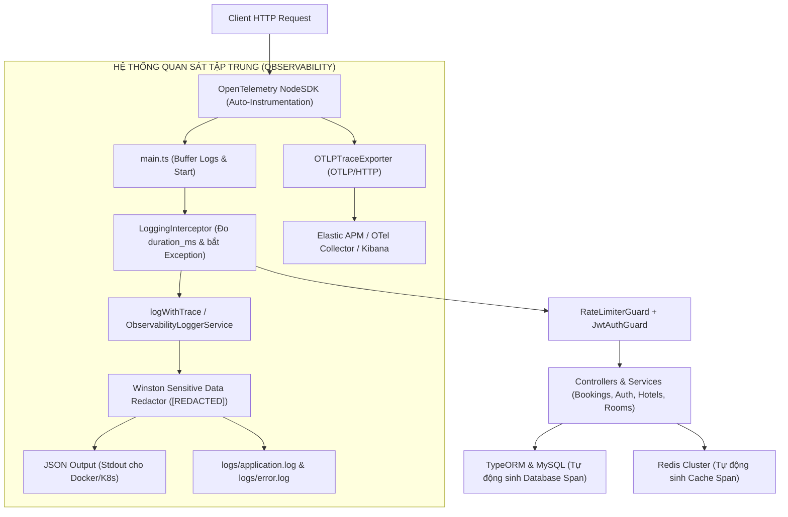

# TÀI LIỆU KIẾN TRÚC ENTERPRISE: LOGGING VÀ TRACING TRONG NESTJS VỚI OPENTELEMETRY VÀ ELASTIC STACK (OTLP)
> **Hệ thống Quản lý & Đặt phòng Khách sạn Traveleke**  
> **Ngôn ngữ & Nền tảng:** NestJS 11, TypeScript, OpenTelemetry NodeSDK, Winston, Elastic APM / OTLP, Kibana

---

## MỤC LỤC
1. [TỔNG QUAN OBSERVABILITY TRONG HỆ THỐNG TRAVELEKE](#1-tổng-quan-observability-trong-hệ-thống-traveleke)
2. [CÁC VẤN ĐỀ ĐÃ ĐƯỢC GIẢI QUYẾT TRIỆT ĐỂ](#2-các-vấn-đề-đã-được-giải-quyết-triệt-để)
3. [KIẾN TRÚC TỔNG THỂ (ARCHITECTURE FLOW)](#3-kiến-trúc-tổng-thể-architecture-flow)
4. [CÁC THÀNH PHẦN CODE ĐÃ TRIỂN KHAI](#4-các-thành-phần-code-đã-triển-khai)
   - [4.1. Khởi tạo OpenTelemetry Sớm (`src/observability/otel.ts`)](#41-khởi-tạo-opentelemetry-sớm-srcobservabilityotelts)
   - [4.2. Winston Structured JSON Logger (`src/observability/logger.ts`)](#42-winston-structured-json-logger-srcobservabilityloggerts)
   - [4.3. Log-Trace Correlation (`src/observability/trace-logger.ts`)](#43-log-trace-correlation-srcobservabilitytrace-loggerts)
   - [4.4. Global Logging Interceptor (`src/observability/logging.interceptor.ts`)](#44-global-logging-interceptor-srcobservabilitylogginginterceptorts)
5. [CƠ CHẾ RESILIENT (NON-BLOCKING & FAIL-SAFE)](#5-cơ-chế-resilient-non-blocking--fail-safe)
6. [HƯỚNG DẪN TRUY VẾT & DEBUG THỰC TẾ TRÊN KIBANA / ELASTIC](#6-hướng-dẫn-truy-vết--debug-thực-tế-trên-kibana--elastic)
7. [TỔNG KẾT BỘ BA TRỤ CỘT BẢO MẬT & VẬN HÀNH](#7-tổng-kết-bộ-ba-trụ-cột-bảo-mật--vận-hành)

---

## 1. TỔNG QUAN OBSERVABILITY TRONG HỆ THỐNG TRAVELEKE

Trong một hệ thống đặt phòng khách sạn trực tuyến có tải cao, một yêu cầu từ người dùng (`POST /api/bookings`) phải đi qua nhiều tầng:
* `Client` (Next.js)
* `RateLimiterGuard` (Redis Sliding Window & Token Bucket)
* `JwtAuthGuard` (Giải mã & xác thực người dùng)
* `LoggingInterceptor` & `UserContextInterceptor` (AsyncLocalStorage context)
* `BookingsController`
* `BookingsService` (Kiểm tra phòng, tính giá, phân công nhân viên)
* `TypeORM` & `MySQL Database`
* `MailService` (Gmail SMTP gửi mã xác nhận)

Nếu có sự cố phát sinh (ví dụ: đặt phòng bị chậm 4 giây, hoặc lỗi trừ tiền), lập trình viên không thể chỉ mở console hoặc đoán mò. Hệ thống cần khả năng **Observability** toàn diện:
1. **Logs:** Cho biết *chuyện gì đã xảy ra* (What happened?).
2. **Traces:** Cho biết *request đã đi qua đâu và mất bao nhiêu mili-giây ở từng khâu* (Where and how long?).
3. **Log-Trace Correlation:** Cho phép lấy `trace_id` từ một log lỗi để mở ngay lập tức toàn bộ cây thực thi (Execution Tree) trên Kibana.

---

## 2. CÁC VẤN ĐỀ ĐÃ ĐƯỢC GIẢI QUYẾT TRIỆT ĐỂ

| Vấn đề trước khi sửa | Rủi ro trong Production | Giải pháp chuẩn hoá đã áp dụng |
| :--- | :--- | :--- |
| **Dùng `console.log` / `console.error` thô** | Log dạng text không index được trong Elasticsearch; không có timestamp chuẩn ISO; không có metadata; làm nghẽn I/O khi chạy tải cao. | **Winston Structured JSON Logger** (`src/observability/logger.ts`) với cấu trúc JSON chuẩn hóa `timestamp`, `level`, `service`, `message`, `trace_id`, `span_id`. |
| **Không có Trace ID trong Log** | Khi có hàng triệu log/ngày, không thể biết log này thuộc request nào giữa hàng ngàn request đồng thời. | **Log-Trace Correlation** (`src/observability/trace-logger.ts`): Tự động trích xuất `trace_id` và `span_id` từ OpenTelemetry gắn vào từng log entry. |
| **Khởi tạo OpenTelemetry quá trễ** | Nếu import OTel sau khi NestJS đã load, Auto-Instrumentation không thể bắt được các thư viện HTTP, Express, MySQL, Redis. | Khởi tạo `import './observability/otel';` **ngay tại dòng đầu tiên của `main.ts`**. |
| **Nguy cơ rò rỉ dữ liệu nhạy cảm** | Vô tình in password, token bí mật, mã OTP hoặc số thẻ ngân hàng vào file log. | **Custom Redaction Format**: Tự động duyệt và thay thế toàn bộ trường `password`, `token`, `secret`, `jwt`, `cardnumber`, `cvv`, `authorization` thành `[REDACTED]`. |
| **Không đo lường được Request Duration** | Không biết endpoint nào đang bị nghẽn (bottleneck). | **LoggingInterceptor**: Tự động đo thời gian hoàn thành của 100% request, tự động phát hiện và gắn nhãn `[SLOW_REQUEST]` nếu quá 1500ms. |

---

## 3. KIẾN TRÚC TỔNG THỂ (ARCHITECTURE FLOW)



---

## 4. CÁC THÀNH PHẦN CODE ĐÃ TRIỂN KHAI

### 4.1. Khởi tạo OpenTelemetry Sớm (`src/observability/otel.ts`)
* Đăng ký `NodeSDK` kết hợp `getNodeAutoInstrumentations()`.
* Tự động tạo Spans cho HTTP Request, Express Router, MySQL Queries, Redis Commands.
* Sử dụng `OTLPTraceExporter` gửi telemetry theo chuẩn OpenTelemetry Protocol (OTLP/HTTP) tới Elastic APM hoặc OTel Collector (`http://localhost:8200/v1/traces`).
* Đăng ký xử lý tín hiệu `SIGTERM` và `SIGINT` cho **Graceful Shutdown** (`otelSdk.shutdown()`).

### 4.2. Winston Structured JSON Logger (`src/observability/logger.ts`)
* Định dạng JSON tiêu chuẩn cho Cloud Native / Container:
  ```json
  {
    "timestamp": "2026-09-23T15:08:04.120Z",
    "level": "info",
    "service": "traveleke-backend",
    "environment": "development",
    "message": "GET /api/hotels 200 - 18ms",
    "trace_id": "4bf92f3577b34da6a3ce929d0e0e4736",
    "span_id": "00f067aa0ba902b7",
    "http": {
      "method": "GET",
      "url": "/api/hotels",
      "status_code": 200,
      "duration_ms": 18
    },
    "ip": "127.0.0.1"
  }
  ```
* Bọc bảo vệ dữ liệu nhạy cảm tự động: Bất kể developer nào vô tình truyền object chứa `password` hay `token` vào logger, hệ thống sẽ tự động biến thành `[REDACTED]`.

### 4.3. Log-Trace Correlation (`src/observability/trace-logger.ts`)
* Cung cấp hàm tiện ích `logWithTrace(level, message, meta)`:
  ```typescript
  logWithTrace('info', 'Đơn đặt phòng mới đã được tạo', {
    bookingId: booking.id,
    hotelId: booking.hotelId,
  });
  ```
* Cung cấp class `ObservabilityLoggerService implements LoggerService`: Tích hợp trực tiếp vào NestJS qua `app.useLogger(...)` để mọi log khởi động, controller, guard đều có định dạng chuẩn.

### 4.4. Global Logging Interceptor (`src/observability/logging.interceptor.ts`)
* Đo đạc chính xác thời gian thực thi của mỗi request:
  - Nếu thời gian xử lý > `1500ms`: Tự động kích hoạt mức `WARN` kèm nhãn `[SLOW_REQUEST]`.
  - Nếu phát sinh exception: Ghi log `ERROR` kèm `trace_id` và mã HTTP tương ứng.

---

## 5. CƠ CHẾ RESILIENT (NON-BLOCKING & FAIL-SAFE)

Theo nguyên tắc Mục 69 & 70 của tài liệu: **Hạ tầng giám sát (Observability) không bao giờ được phép làm ảnh hưởng đến tính sẵn sàng của ứng dụng nghiệp vụ.**
* **Không làm crash ứng dụng:** Nếu Elastic APM hoặc OTel Collector chưa được bật ở môi trường local hoặc gặp sự cố mạng, `OTLPTraceExporter` có timeout ngắn (3 giây) và bắt lỗi ngầm trong background.
* **Không block request:** Các thao tác xuất trace và ghi log diễn ra bất đồng bộ qua stream buffer, không làm chậm quá trình phản hồi API cho người dùng.

---

## 6. HƯỚNG DẪN TRUY VẾT & DEBUG THỰC TẾ TRÊN KIBANA / ELASTIC

Khi khách hàng báo lỗi: *"Tôi bấm đặt phòng nhưng hệ thống báo lỗi hoặc xoay tròn"*:

```text
BƯỚC 1: Tìm Error Log trong Kibana
Query: service.name: "traveleke-backend" AND level: "error"

BƯỚC 2: Trích xuất trace_id
Ví dụ: trace_id = "4bf92f3577b34da6a3ce929d0e0e4736"

BƯỚC 3: Mở màn hình Traces trong Kibana APM
Dán trace_id vào thanh tìm kiếm.

BƯỚC 4: Phân tích biểu đồ thác nước (Waterfall Trace Chart)
POST /api/bookings           4100 ms
├── NestJS Routing             5 ms
├── RateLimiterGuard (Redis)   3 ms
├── BookingsService.create    12 ms
├── TypeORM MySQL Query       20 ms
└── Gmail SMTP SendMail     4060 ms  ◄◄◄ [NGUYÊN NHÂN NGHẼN: SMTP server phản hồi chậm]
```
Nhờ có Tracing, lập trình viên xác định chính xác 100% nguyên nhân chỉ trong 30 giây mà không cần đoán mò!

---

## 7. TỔNG KẾT BỘ BA TRỤ CỘT BẢO MẬT & VẬN HÀNH

Hệ thống **Traveleke** hiện sở hữu kiến trúc hoàn chỉnh cấp Doanh nghiệp:

```text
1. RATE LIMITING ĐA TẦNG (Redis + Token Bucket + Sliding Window)
   ► Bảo vệ Cửa ngõ bên ngoài: Chống Brute-force, Spam, Bot Scraping, Quá tải.

2. AUDIT LOGGING ENGINE (AsyncLocalStorage + TypeORM Subscribers)
   ► Bảo vệ Dữ liệu bên trong: Giám sát 100% biến động CSDL, Chống gian lận nội bộ.

3. OPENTELEMETRY & STRUCTURED LOGGING (OTel + Winston + Elastic APM)
   ► Vận hành & Giám sát Hệ thống: Truy vết hành trình request, Phát hiện điểm nghẽn hiệu năng tức thì.
```
